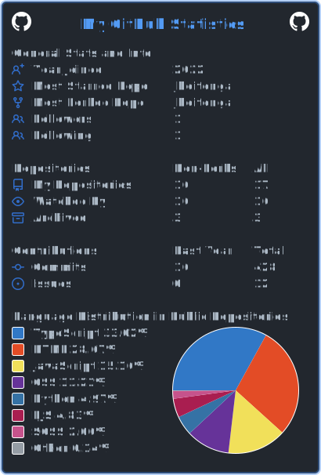

<!DOCTYPE html>
<html>
  <head>
    <meta charset="utf-8">
    <meta name="description" content="Author: Jennifer Hoitenga">
  </head>
</html>

<h1>𝙷𝚒, 𝙸'𝚖 𝙹𝚎𝚗𝚗𝚒𝚏𝚎𝚛 </h1>

𝙸 𝚊𝚖 𝚊 𝚜𝚝𝚞𝚍𝚎𝚗𝚝 𝚊𝚝 𝙱𝚎𝚕𝚕𝚎𝚟𝚞𝚎 𝚄𝚗𝚒𝚟𝚎𝚛𝚜𝚒𝚝𝚢 𝚠𝚘𝚛𝚔𝚒𝚗𝚐 𝚝𝚘𝚠𝚊𝚛𝚍𝚜 𝚊 𝙱𝚊𝚌𝚑𝚎𝚕𝚘𝚛'𝚜 𝚍𝚎𝚐𝚛𝚎𝚎 𝚒𝚗 𝚠𝚎𝚋 𝚍𝚎𝚟𝚎𝚕𝚘𝚙𝚖𝚎𝚗𝚝.

 
<h2>:woman_technologist: 𝙲𝚞𝚛𝚛𝚎𝚗𝚝 𝚆𝚎𝚋 𝙳𝚎𝚟𝚎𝚕𝚘𝚙𝚖𝚎𝚗𝚝 𝚂𝚝𝚊𝚌𝚔:</h2>

 

  

  <h2>📈 𝙼𝚢 𝙶𝚒𝚝𝙷𝚞𝚋 𝚂𝚝𝚊𝚝𝚜:</h2>

 

 

