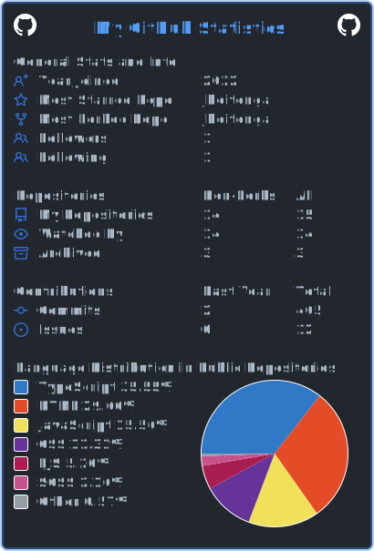

<!DOCTYPE html>
<html>
  <head>
    <meta charset="utf-8">
    <meta name="description" content="Author: Jennifer Hoitenga">
  </head>
</html>

<h1>𝙷𝚒, 𝙸'𝚖 𝙹𝚎𝚗𝚗𝚒𝚏𝚎𝚛 </h1>

𙸠ğšŠğš– 𚊠ğšœğšğšğšğšğš—ğš ğšŠğš ğ™±ğšğš•ğš•ğšğšŸğšğš ğš„ğš—ğš’ğšŸğšğš›ğšœğš’ğšğš¢ ğš ğš˜ğš›ğš”ğš’ğš—ğš ğšğš˜ğš ğšŠğš›ğšğšœ 𚊠ğ™±ğšŠğšŒğš‘ğšğš•ğš˜ğš›'𚜠ğšğšğšğš›ğšğš ğš’ğš— ğš ğšğš‹ ğšğšğšŸğšğš•ğš˜ğš™ğš–ğšğš—ğš.

<ul>
  <li>😄 𝙼𝚢 𝙿𝚛𝚘𝚗𝚘𝚞𝚗𝚜: 𝚂𝚑𝚎 / 𝙷𝚎𝚛 / 𝙷𝚎𝚛𝚜</li>
  <li>📫 𝙷𝚘𝚠 𝚝𝚘 𝚛𝚎𝚊𝚌𝚑 𝚖𝚎: <a href="mailto:jahoitenga@gmail.com">𝚂𝚎𝚗𝚍 𝙴𝚖𝚊𝚒𝚕</a></li>
</ul>

 
<h2>👨‍💻 𝙲𝚞𝚛𝚛𝚎𝚗𝚝 𝚆𝚎𝚋 𝙳𝚎𝚟𝚎𝚕𝚘𝚙𝚖𝚎𝚗𝚝 𝚂𝚝𝚊𝚌𝚔:</h2>

 

  

  <h2>📈 𝙼𝚢 𝙶𝚒𝚝𝙷𝚞𝚋 𝚂𝚝𝚊𝚝𝚜:</h2>

 

 

 𝙻𝚒𝚗𝚔 𝚝𝚘 <a href="https://jhoitenga.wrapped.run" target="_blank"><b>𝙶𝚒𝚝𝙷𝚞𝚋 𝚆𝚛𝚊𝚙𝚙𝚎𝚍</b></a>

